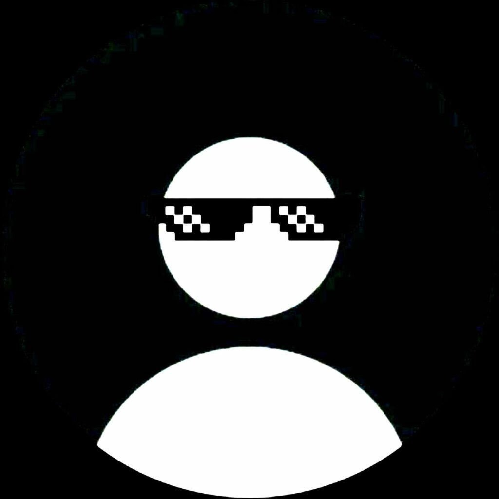

<div align="center">
  
  
  # Praveen's Terminal Portfolio 🚀
  
  **An interactive, command-line interface developer portfolio powered by AI.**
  
  [](https://praveen7928.vercel.app/)
  []()
  []()
  []()
</div>

<br/>

Welcome to my digital workspace. This project transforms the traditional web portfolio into a fully interactive UNIX-style terminal experience. It's built for developers, recruiters, and tech enthusiasts who love the command line as much as I do.

## ✨ Features

- **💻 Interactive Command Line:** Execute commands like `ls`, `cd`, `cat`, and `clear` to explore my projects and experience.
- **🤖 Built-in AI Agent:** Ask the terminal natural questions. Powered by a secure serverless backend utilizing the Google Gemini API, the agent knows my entire resume and can chat intelligently about my background.
- **⚡ Organic Printing Animations:** Terminal outputs cascade gracefully line-by-line for an authentic, snappy CRT feel.
- **🎨 Glassmorphism UI:** A sleek, draggable macOS-style window sitting on a modern web canvas.
- **📱 Fully Responsive:** Carefully optimized with mobile-first media queries to ensure the terminal looks incredible on any device or screen size.
- **💊 Matrix Mode:** Type `matrix` for a high-performance `<canvas>` rain Easter egg. Type `escape` to return to reality.

## 🛠️ Tech Stack

- **Frontend:** React, Vite, Vanilla CSS (Glassmorphism & Responsive Design)
- **Backend (Serverless):** Vercel Serverless Functions (`api/chat.js`)
- **AI Integration:** `@google/generative-ai` (Gemini 2.5 Flash)
- **Deployment & CI/CD:** Vercel 

## 🚀 Local Installation

1. **Clone the repository**
   ```bash
   git clone https://github.com/Myself-Praveen/Portfolio.git
   cd Portfolio
   ```

2. **Install dependencies**
   ```bash
   npm install
   ```

3. **Set up Environment Variables**
   Create a `.env` file in the root directory and add your Google Gemini API key:
   ```env
   VITE_GEMINI_API_KEY=your_api_key_here
   ```

4. **Run the development server**
   ```bash
   npm run dev
   ```

## 🌐 Live Preview

You can interact with the live version of this portfolio here:  
🔗 **[praveen7928.vercel.app](https://praveen7928.vercel.app/)**

## 🤝 Connect With Me

- **GitHub:** [@Myself-Praveen](https://github.com/Myself-Praveen)
- **LinkedIn:** [Praveen Mishra](https://www.linkedin.com/in/itz-praveen-mishra/)

---
*Built with ❤️ and excessive amounts of coffee.*
